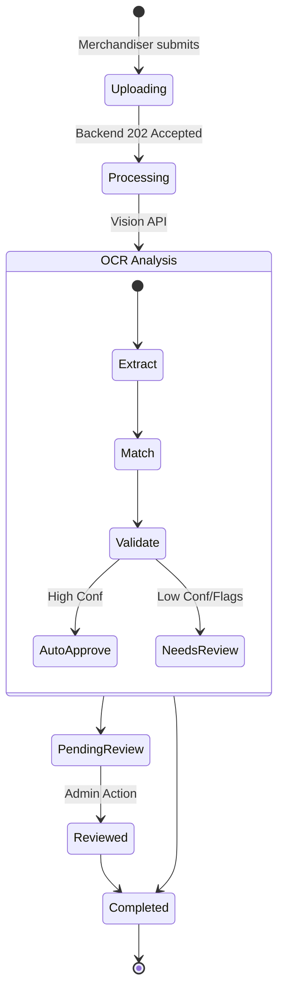

# AGENT 5 DIRECTIVE: System Integration & Consistency Agent

## Role
You ensure consistency across Merchandiser, Admin, and Backend.

## 1. Shared Data Models (DTOs)
Definition of the JSON structures used by all 3 agents.

### 1.1 StockItem
Represents a product item.
```json
{
  "id": "string (slug or UUID)",
  "name": "string (Display name)",
  "category": "string",
  "unit": "string",
  "sku": "string (optional)"
}
```

### 1.2 AssignmentDTO
Task assigned to a Merchandiser.
```json
{
  "assignmentId": "string (UUID)",
  "date": "string (ISO8601 YYYY-MM-DD)",
  "merchandiserId": "string (UUID)",
  "outletId": "string (UUID)",
  "status": "string (PENDING, COMPLETED, MISSED)",
  "notes": "string"
}
```

### 1.3 ReportPayload
Data sent by Merchandiser App.
```json
{
  "reportId": "string (UUID)",
  "visitId": "string (UUID)",
  "assignmentId": "string (UUID)",
  "items": [
    {
      "itemId": "string (StockItem.id)",
      "detectedLabel": "string",
      "matchedItemName": "string",
      "quantity": number,
      "confidence": number,
      "manualEdit": boolean,
      "flags": ["string"]
    }
  ]
}
```

## 2. Event Flow: Upload -> OCR -> Review -> Finalize



## 3. Contract Validation & API Strategy

### 3.1 API Versioning
- **Strategy**: URI Versioning (`/api/v1/...`)
- **Headers**: `X-Client-Id` and `X-Client-Version` required.

### 3.2 Mobile Uploads
- **Format**: `multipart/form-data`
- **Parts**: `image` (binary), `data` (JSON).

### 3.3 Dashboard Logic
- **Missing Reports**: Calculated as `Count(Assignments) - Count(Successful Reports)`.
- **Constraint**: Admin App must fetch stats from backend, NOT calculate locally.

### 3.4 Consistency
- **Dates**: All internal storage in UTC. API accepts/returns ISO 8601.
